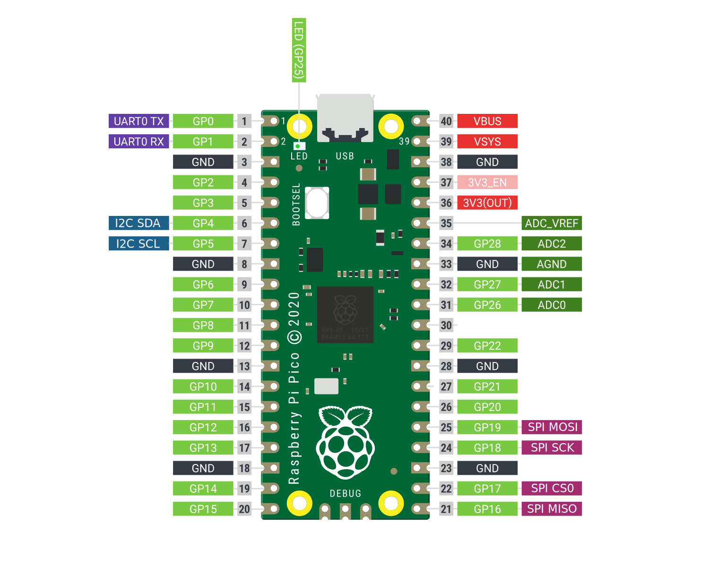

# Raspberry Pi Pico USB I/O Board

This project turns the Raspberry Pi Pico into a USB I/O Board.

It implements the USB protocol used by the dln2 Linux drivers and in addition it supports 2 CDC UARTS.



See [wiki](https://github.com/notro/pico-usb-io-board/wiki) for more information.


# Build
```
$ cd pico-usb-io-board
$ ./build.sh

```

The ```BUILD_DIR``` environment variable can be used to put the build files elsewhere.


# License

Unless otherwise stated, all code and data is licensed under a [CC0 license](https://creativecommons.org/publicdomain/zero/1.0/).

The [Openmoko Product ID](https://github.com/openmoko/openmoko-usb-oui) [1d50:6170](https://github.com/openmoko/openmoko-usb-oui/pull/35) can only be used under a [FOSS license](https://github.com/openmoko/openmoko-usb-oui#conditions).

["Raspberry Pi Pico Pinout Diagram"](https://www.raspberrypi.com/documentation/microcontrollers/images/Pico-R3-SDK11-Pinout.svg) by [Raspberry Pi (Trading) Ltd](https://www.raspberrypi.com/), used under [CC BY-SA](https://creativecommons.org/licenses/by-sa/4.0/) / Pinout simplified from original
